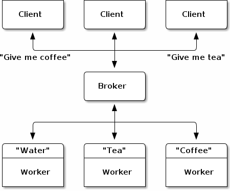

# zeromq-experiment
Questo progetto è un esperimento per valutare l'utilizzo di
[ZeroMQ](https://zeromq.org/) 
come libreria di messaggistica per software di veicoli autonomi, come il veicolo
[F1/10](https://f1tenth.org/).  
Questo è un progetto universitario per il corso "Real-Time Embedded Systems", per l'Università degli studi di Modena e Reggio Emilia, anno 2022-2023.

## Introduzione
### ROS2
ROS2 è un framework open source basato su un modello di pubblicazione/sottoscrizione, in cui i messaggi vengono inviati da un nodo a un altro. Questo consente ai nodi di comunicare tra loro in modo semplice e tramite diversi livelli di affidabilità.
ROS2 non implementa un suo middleware (ovvero il software che si occupa dello scambio di messaggi fra i nodi), ma utilizza eProsima Fast DDS.
Fast DDS, a sua volta, utilizza UDP.
ROS2, quindi, è un framework completo con un suo sistema di compilazione, gestione pacchetti, scoperta dei nodi, riproduzione dei dati, etc.  
### ZeroMQ
ZeroMQ è una libreria di messaggistica asincrona ad alte prestazioni, leggera e semplice che consente agli sviluppatori di creare applicazioni distribuite e concorrenti. È una libreria leggera e semplice da usare, che offre una vasta gamma di funzionalità per soddisfare una varietà di esigenze.  
Al contrario di ROS2, quindi, non vengono offerti servizi ulteriori.
ZeroMQ utilizza TCP come ulteriore controllo di errori e perdita dati.  

---

ZeroMQ, quindi, si presenta come una soluzione più difficile da utilizzare ma più leggera.
### Obiettivo del progetto
L'obiettivo del progetto è di confrontare la latenza delle due soluzioni software e stabilire la soluzione di minore latenza.

## Background
I pattern di comunicazioni sono indipendenti dalla soluzione scelta.  
Tuttavia, in ROS2 si preferisce utilizzare il pattern PUB-SUB.
### Pattern Pubblicazione - Sottoscrizione (PUB-SUB)

### Pattern del maggiordomo
  

Nel pattern del maggiordomo, i nodi client si interfacciano con un nodo intermediario (broker), che inoltrerà il messaggio al 
nodo responsabile dell'elaborazione dei dati (server). Ciò rende possibile l'utilizzo di intestazioni diversi, la presenza dinamica di più
server e client e garantisce una certa affidabilità nello scambio di messaggi.

TODO: Capire e spiegare con degli schemi come funziona la comunicazione intraprocesso, interprocesso e internodo su ROS2
TODO: Spiegare con degli schemi come funziona la comunicazione intraprocesso, interprocesso e internodo su ZeroMQ  


# Valutazione
## Ambiente di valutazione
Per lo sviluppo e i test sono state usate due NVIDIA Jetson Nano Developer Kit, 
collegate tramite Ethernet ai portatili degli studenti.
L'ambiente di sviluppo utilizzato è stato VS Code in modalità remota (SSH).
```sh
root@nano:~# lsb_release -a
No LSB modules are available.
Distributor ID: Ubuntu
Description:    Ubuntu 20.04.6 LTS
Release:        20.04
Codename:       focal

sudo jetson-release

Software part of jetson-stats 4.2.2 - (c) 2023, Raffaello Bonghi
Model: NVIDIA Jetson Nano Developer Kit - Jetpack 4.6 [L4T 32.6.1]
NV Power Mode[0]: MAXN
Serial Number: [XXX Show with: jetson_release -s XXX]
Hardware:
 - P-Number: p3448-0000
 - Module: NVIDIA Jetson Nano (4 GB ram)
Platform:
 - Distribution: Ubuntu 20.04 focal
 - Release: 4.9.253-tegra
jtop:
 - Version: 4.2.2
 - Service: Inactive
Libraries:
 - CUDA: 10.2.300
 - cuDNN: 8.2.1.32
 - TensorRT: 8.0.1.6
 - VPI: 1.1.15
 - Vulkan: 1.2.141
 - OpenCV: 4.6.0 - with CUDA: YES
```
- Toolchain utilizzata per i test: **GCC 9.4.0 aarch64-linux-gnu**
- Versione di ROS2 utilizzata: **Foxy Fitzroy**
- Versione di ZeroMQ utilizzata: **4.3.2**

E' stato usato
[PlotJuggler](https://github.com/facontidavide/PlotJuggler) 3.7.1 
per visualizzare in tempo reale la telemetria dei nodi.

## Metodologia di valutazione
- Il sistema operativo è stato preparato con [queste](docs/real-time-tricks.md) istruzioni.
- Le flag del compilatore sono quelle predefinite.

Sono stati implementati i seguenti pattern:
 - [Il pattern del maggiordomo](https://rfc.zeromq.org/spec/7/)
 - [Pattern pub-sub](https://rfc.zeromq.org/spec/29/).  

In entrambi i casi, la parte inviante:
1. **Invia** un messaggio ogni 10ms, aumentandone ad ogni iterazione la dimensione di **1000 byte**. (La funzione di invio non è sincrona, il che significa che il messaggio viene inviato mentre il programma continua ad eseguire). Il messaggio ha contenuto casuale, per evitare influenze da parte di compressori e cache.
2. **Campiona** il tempo attuale.
3. **Attende la risposta** dalla parte ricevente.
4. **Campiona** il tempo attuale.
5. Calcola la **differenza** tra i due tempi campionati e manda al canale di **telemetria**.

Questa metodologia ci consente di calcolare il **Round Trip Time** (RTT) e di avere un'idea quindi della latenza, sia media che massima, del sistema, all'aumentare della dimensione del messaggio.

Questi pattern sono stati sviluppati sia per ROS2 che per ZeroMQ, in modo da poter confrontare le due soluzioni.

Ogni test è stato eseguito su entrambe le schede, con PlotJuggler a registrare i dati e a visualizzarli in tempo reale.  


## Risultati delle valutazioni
[issue](https://github.com/ElDavoo/zeromq-experiment/issues/1)
Qua grafici, dati, etc etc

# Conclusioni
ZeroMQ va bene per messaggi piccoli ed è più veloce, o forse no? 

# Riproduzione del progetto
Seguire la
[guida apposita](docs/building.md)
per riprodurre il progetto.