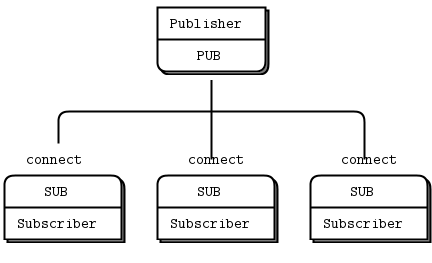
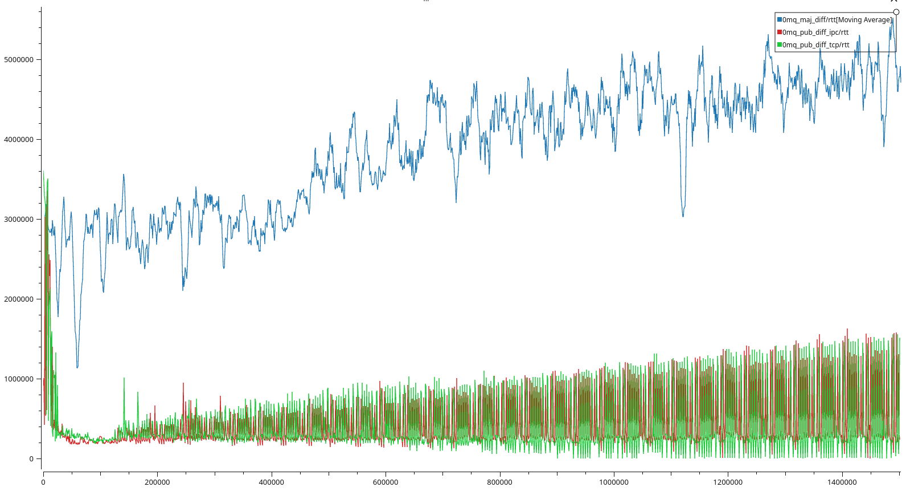

# zeromq-experiment
Questo progetto è un esperimento per valutare l'utilizzo di
[ZeroMQ](https://zeromq.org/) 
come libreria di messaggistica per software di veicoli autonomi, come il veicolo
[F1/10](https://f1tenth.org/).  
Questo è un progetto universitario per il corso "Real-Time Embedded Systems", per l'Università degli studi di Modena e Reggio Emilia, anno 2022-2023.

## Introduzione
### ROS2
ROS2 è un framework open source basato su un modello di pubblicazione/sottoscrizione, in cui i messaggi vengono inviati da un nodo a un altro. Questo consente ai nodi di comunicare tra loro in modo semplice e tramite diversi livelli di affidabilità.
ROS2 non implementa un suo middleware (ovvero il software che si occupa dello scambio di messaggi fra i nodi), ma utilizza eProsima Fast DDS.
Fast DDS, a sua volta, utilizza UDP.
ROS2, quindi, è un framework completo con un suo sistema di compilazione, gestione pacchetti, scoperta dei nodi, riproduzione dei dati, etc.  
### ZeroMQ
ZeroMQ è una libreria di messaggistica asincrona ad alte prestazioni, leggera e semplice che consente agli sviluppatori di creare applicazioni distribuite e concorrenti. È una libreria leggera e semplice da usare, che offre una vasta gamma di funzionalità per soddisfare una varietà di esigenze.  
Al contrario di ROS2, quindi, non vengono offerti servizi ulteriori.
ZeroMQ utilizza TCP come ulteriore controllo di errori e perdita dati.  

---

ZeroMQ, quindi, si presenta come una soluzione più difficile da utilizzare ma più leggera.
### Obiettivo del progetto
L'obiettivo del progetto è di confrontare la latenza delle due soluzioni software e stabilire la soluzione di minore latenza.

## Background
I pattern di comunicazioni sono indipendenti dalla soluzione scelta.  
Tuttavia, in ROS2 si preferisce utilizzare il pattern PUB-SUB.
### Pattern Pubblicazione - Sottoscrizione (PUB-SUB)


Nel pattern publicazione - sottoscrizione (documentato in lingua inglese come publisher - subscriber pattern), i nodi si interfacciano tra di loro scambiandosi direttamente determinate informazioni detti messaggi.
Entrando maggiormente nel dettaglio, il nodo che fa da publisher pubblicherà un messaggio all'interno di un preciso topic, ovvero una sorta di mailbox, a cui si iscriveranno tutti i nodi subscriber che vorranno recepire quelle informazioni. Non è escluso che ci siano più nodi che pubblicano i messaggi ed inoltre solo i nodi di tipo publisher potranno inviare messaggi al topic: si può parlare, quindi, di comunicazione N-to-N unidirezionale.

### Pattern del maggiordomo
  

Nel pattern del maggiordomo, i nodi client si interfacciano con un nodo intermediario (broker), che inoltrerà il messaggio al 
nodo responsabile dell'elaborazione dei dati (server). Ciò rende possibile l'utilizzo di intestazioni diversi, la presenza dinamica di più
server e client e garantisce una certa affidabilità nello scambio di messaggi.

### Comunicazione tra nodi ROS2
ROS2 utilizza una nuova infrastruttura di comunicazione basata su Data Distribution Service (DDS), che migliora le prestazioni, la scalabilità e la sicurezza rispetto alla vecchia infrastruttura ROS1 basata sul protocollo TCP/UDP. Esistono implementazioni propritarie del DDS prodotte da svariati produttori ma è stata utilizzata quella utilizzata da ROS2 Foxy di default, ovvero [eProsima Fast](https://docs.ros.org/en/foxy/Installation/DDS-Implementations/Working-with-eProsima-Fast-DDS.html).

Sono state anche esplorate alcune configurazioni relative al QoS, nella fattispecie quelle necessarie al fine di rendere il canale non affidabile sulla falsariga del protocollo UDP.
Essa è utilizzata under-the-hood dal framework in maniera trasparente per l'utente.
```c
static const rmw_qos_profile_t unreliable_qos_profile =
{
    RMW_QOS_POLICY_HISTORY_KEEP_LAST,
    0, //queue depth
    RMW_QOS_POLICY_RELIABILITY_BEST_EFFORT,
    RMW_QOS_POLICY_DURABILITY_VOLATILE,
    RMW_QOS_DEADLINE_DEFAULT,
    RMW_QOS_LIFESPAN_DEFAULT,
    RMW_QOS_POLICY_LIVELINESS_SYSTEM_DEFAULT,
    RMW_QOS_LIVELINESS_LEASE_DURATION_DEFAULT,
    false // useless
};
```

### Comunicazione tra nodi ZeroMQ
ZeroMQ permette l'utilizzo di svariati protocolli di trasporto, la cui scelta è dettata dai requisiti del sistema che si sta andando a sviluppare ed esse risultano essere invisibili alle API da utilizzare per la trasmissione dei messaggi; possono, quindi, essere utilizzate indipendentemente dal protocollo. Particolarità degne di nota risultano essere: 
1. non esiste un metodo `zmq_accept()`, quindi quando un socket è associato a un endpoint, inizia automaticamente ad accettare connessioni;
2. la connessione di rete stessa avviene in background. ZeroMQ, si riconnetterà automaticamente se la connessione di rete dovesse essere interrotta (ad esempio, se il peer scompare e poi ritorna); quindi tutto avviene in maniera trasparente rispetto all'utente.

Negli applicativi sviluppati per il benchmark, si è preferito utilizzare il tcp e l'ipc (interprocesso) in quanto sono due protocolli le cui proprietà maggiormente si avvicinano a quelli presenti in ROS2.
#### TCP
```sh
zmq_bind (socket, "tcp://*:5555");
```
TCP è il trasporto unicast onnipresente, affidabile e affidabile. Nell'implementazione di ZeroMQ, è di tipo disconnesso in quanto non richiede che l'endpoint esista prima di connettersi ad esso. I client e i server possono connettersi e associarsi in qualsiasi momento, possono chiudersi e riaprirsi e rimanere sempre trasparenti alle applicazioni.
#### IPC
```sh
zmq_bind (socket, "ipc://somename");
```
Anche IPC risulta essere disconnesso, come TCP; è implementato creando un file che verrà acceduto in scrittura dai nodi publisher e in sola lettura dai nodi subscriber.

### Schemi di comunicazione
Sono riportati due schemi che riassumono le comunicazioni che avvengono tra i vari nodi, sia per le implementazioni ROS2 che per quelle ZeroMQ, con la nomenclatura dei topic utilizzata. In quest'ultimo, in quanto un canale di comunicazione (socket TCP o IPC) può essere utilizzato in maniera bidirezionale, tra le varie coppie di nodi è presenta una sola porta.
#### ZeroMQ

#### ROS2


# Valutazione
## Ambiente di valutazione
Per lo sviluppo e i test sono state usate due NVIDIA Jetson Nano Developer Kit, 
collegate tramite Ethernet ai portatili degli studenti.
L'ambiente di sviluppo utilizzato è stato VS Code in modalità remota (SSH).
```sh
root@nano:~# lsb_release -a
No LSB modules are available.
Distributor ID: Ubuntu
Description:    Ubuntu 20.04.6 LTS
Release:        20.04
Codename:       focal

sudo jetson-release

Software part of jetson-stats 4.2.2 - (c) 2023, Raffaello Bonghi
Model: NVIDIA Jetson Nano Developer Kit - Jetpack 4.6 [L4T 32.6.1]
NV Power Mode[0]: MAXN
Serial Number: [XXX Show with: jetson_release -s XXX]
Hardware:
 - P-Number: p3448-0000
 - Module: NVIDIA Jetson Nano (4 GB ram)
Platform:
 - Distribution: Ubuntu 20.04 focal
 - Release: 4.9.253-tegra
jtop:
 - Version: 4.2.2
 - Service: Inactive
Libraries:
 - CUDA: 10.2.300
 - cuDNN: 8.2.1.32
 - TensorRT: 8.0.1.6
 - VPI: 1.1.15
 - Vulkan: 1.2.141
 - OpenCV: 4.6.0 - with CUDA: YES
```
- Toolchain utilizzata per i test: **GCC 9.4.0 aarch64-linux-gnu**
- Versione di ROS2 utilizzata: **Foxy Fitzroy**
- Versione di ZeroMQ utilizzata: **4.3.2**

E' stato usato
[PlotJuggler](https://github.com/facontidavide/PlotJuggler) 3.7.1 
per visualizzare in tempo reale la telemetria dei nodi, installato su un pc separato.

## Metodologia di valutazione

Consultare la [guida apposita](docs/building.md) per visualizzare i comandi precisi.

- Il sistema operativo è stato preparato con [queste](docs/real-time-tricks.md) istruzioni.
- Le flag del compilatore sono quelle predefinite.

Sono stati implementati i seguenti pattern:
 - [Il pattern del maggiordomo](https://rfc.zeromq.org/spec/7/)
 - [Pattern pub-sub](https://rfc.zeromq.org/spec/29/).  

In entrambi i casi, la parte inviante:
1. **Invia** un messaggio ogni 10ms, aumentandone ad ogni iterazione la dimensione di **1000 byte**. (La funzione di invio non è sincrona, il che significa che il messaggio viene inviato mentre il programma continua ad eseguire). Il messaggio ha contenuto casuale, per evitare influenze da parte di compressori e cache.
2. **Campiona** il tempo attuale.
3. **Attende la risposta** dalla parte ricevente.
4. **Campiona** il tempo attuale.
5. Calcola la **differenza** tra i due tempi campionati e manda al canale di **telemetria** (topic apposito).

Questa metodologia ci consente di calcolare il **Round Trip Time** (RTT) e di avere un'idea quindi della latenza, sia media che massima, del sistema, all'aumentare della dimensione del messaggio.

Questi pattern sono stati sviluppati sia per ROS2 che per ZeroMQ, in modo da poter confrontare le due soluzioni.

Per ZeroMQ/pub_sub sono stati sviluppati due test, uno con IPC e uno con TCP, per valutare le differenze di prestazioni tra i due protocolli.  
Con ROS2, questo non è stato necessario, in quanto come esplicitato prima esso fa uso del FastDDS che gestisce in maniera trasparente la comunicazione.  

Ogni test è stato eseguito su entrambe le schede, con PlotJuggler a registrare i dati e a visualizzarli in tempo reale.  


## Risultati delle valutazioni
- ZeroMQ con nodi su differenti core

- ZeroMQ con nodi sul medesimo core

- ROS2 con nodi su differenti core

- ROS2 con nodi sul medesimo core

- Visione d'insieme dei vari benchmark


# Conclusioni
Dai vari benchmark effettuati con ZeroMQ è possibile evincere che:
1. Non si notano differenze apprezzabili tra un canale di comunicazione instaurato via TCP e uno via IPC.
2. Il **pattern publisher - subscriber** risulta essere più prevedibile rispetto al **pattern del maggiordomo** in quanto sono presenti delle oscillazioni tra i valori di RTT (per rendere il grafico maggiormente leggibile è stato applicata una media mobile a 10 campioni).

Dai benchmark su ROS2 si può notare che:
1. Il **pattern publisher - subscriber** e quello del **maggiordomo** si equivalgono con un leggero vantaggio a favore di quest'ultimo.

Inoltre è possibile vedere anche una differenza di comportamento in funzione del numero di core utilizzati: infatti ZeroMQ, nonostante abbia *under-the-hood* il supporto multi-thread, fatica in una configurazione multi-core a differenza di ROS2 che risulta essere penalizzato su una configurazione single-core, presumibilmente a causa dell'overhead applicato sui nodi essendo esso un framework a differenza di ZeroMQ il quale è una libreria.


Una cosa che accomuna ambedue le soluzioni è la presenza un maggiore RTT all'inizio della trasmissione che tende ad abbassarsi con l'esecuzione dei nodi: esso è giustificabile con l'overhead presente nei vari casi per la creazione di un canale di comunicazione in quanto i nodi trasmettono già dall'inizio nel mentre esso viene creato.

Si può concludere, quindi, dicendo che ambedue le soluzioni abbiano dei vantaggi e degli svantaggi nel loro utilizzo, a seconda che si lavori con sistemi che possano trarre vantaggio da più core e dalla tipologia di pattern richiesto. Ultima ma non meno importante considerazione da fare è che la versione di ROS2 utilizzata è in fase EOL e risultano notevoli miglioramenti nelle versioni più recenti, in particolar modo sul layer DDS, che potrebbero confutare alcuni dei dati rilevati.

# Riproduzione del progetto
Seguire la
[guida apposita](docs/building.md)
per riprodurre il progetto.