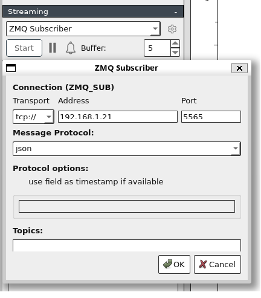
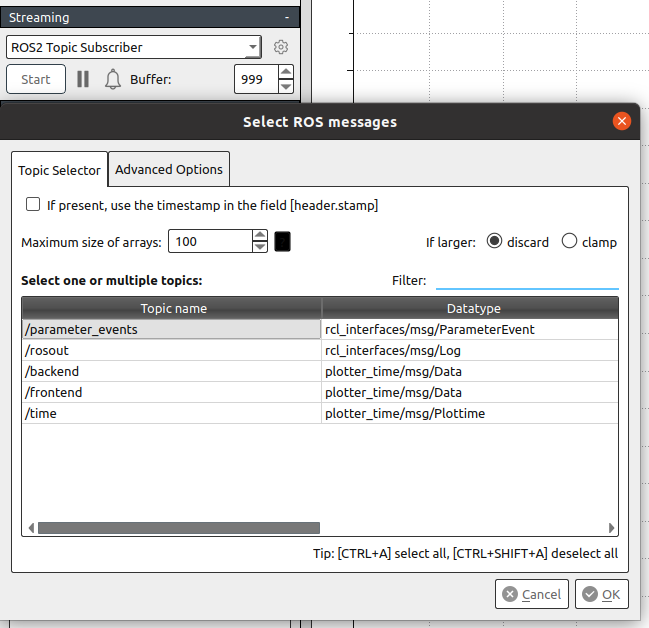

# Guida alla compilazione
## Prerequisiti
- Una macchina con Ubuntu 20.04 LTS. Preferibilmente, una NVIDIA Jetson Nano Developer Kit.
- CMake 3.16.3 o superiore.
- GCC 9.4.0
- ROS2 Foxy Fitzroy
- ZeroMQ 4.3.2
- Taskset, per impostare l'affinità dei processi.
- PlotJuggler

## Download
```sh
git clone git@github.com:ElDavoo/zeromq-experiment.git
```

## Compilazione
E' stato creato un CMakeLists.txt unico per tutti i test zeromq. Quindi:
## Compilazione test ZeroMQ
```sh
cmake -B build/
cd build/
make
```
## Compilazione test ROS2
```sh
cd ros2
colcon build
```
## Esecuzione dei test
### Preparazione
L'esecuzione richiede un terminale per ogni nodo (quindi da 2 a 3).
Siccome abbiamo precedentemente impostato il parametro "*isolcpus=1-3*",
abbiamo a nostra disposizione i core 1, 2 e 3.
Si è anche scelto di eseguire i nodi su un singolo core al fine di comparare i risultati con l'esecuzione su più core.
#### Impostazione di PlotJuggler
- ZeroMQ:  

- ROS2:

Al fine di leggere in tempo reale i dati del topic telemetria di ROS2, Plotjuggler richiede che sulla macchina sia esso installato. 


### Esecuzione test ZeroMQ
#### Core singolo
- Majordomo
```sh
taskset --cpu-list 1 build/zeromq/majordomo/alfredPennyworth/broker
taskset --cpu-list 1 build/zeromq/majordomo/alfredPennyworth/cliente
taskset --cpu-list 1 build/zeromq/majordomo/alfredPennyworth/worker
```
- PubSub IPC
```sh
taskset --cpu-list 1 build/zeromq/pub_sub/ipc/subscriber
taskset --cpu-list 1 build/zeromq/pub_sub/ipc/publisher
```
- PubSub TCP
```sh
taskset --cpu-list 1 build/zeromq/pub_sub/tcp/subscriber
taskset --cpu-list 1 build/zeromq/pub_sub/tcp/publisher
```
#### Core separati
- Majordomo
```sh
taskset --cpu-list 1 build/zeromq/majordomo/alfredPennyworth/broker
taskset --cpu-list 2 build/zeromq/majordomo/alfredPennyworth/cliente
taskset --cpu-list 3 build/zeromq/majordomo/alfredPennyworth/worker
```
- PubSub IPC
```sh
taskset --cpu-list 1 build/zeromq/pub_sub/ipc/subscriber
taskset --cpu-list 2 build/zeromq/pub_sub/ipc/publisher
```
- PubSub TCP
```sh
taskset --cpu-list 1 build/zeromq/pub_sub/tcp/subscriber
taskset --cpu-list 2 build/zeromq/pub_sub/tcp/publisher
```
### Esecuzione test ROS2
```sh
cd ros2
source install/local_setup.bash
```
#### Core singolo
- Majordomo
```sh
taskset --cpu-list 1 build/zeromq/majordomo/alfredPennyworth/broker
taskset --cpu-list 1 build/zeromq/majordomo/alfredPennyworth/cliente
taskset --cpu-list 1 build/zeromq/majordomo/alfredPennyworth/worker
```
- PubSub IPC
```sh
taskset --cpu-list 1 build/zeromq/pub_sub/ipc/subscriber
taskset --cpu-list 1 build/zeromq/pub_sub/ipc/publisher
```
- PubSub TCP
```sh
taskset --cpu-list 1 build/zeromq/pub_sub/tcp/subscriber
taskset --cpu-list 1 build/zeromq/pub_sub/tcp/publisher
```
#### Core separati
- PubSub
```sh
taskset --cpu-list 1 ros2 run pub_sub subscriber
taskset --cpu-list 2 ros2 run pub_sub publisher
```
- Majordomo
```sh
taskset --cpu-list 1 ros2 run alfredpennyworth broker
taskset --cpu-list 2 ros2 run alfredpennyworth cliente
taskset --cpu-list 3 ros2 run alfredpennyworth worker
```
